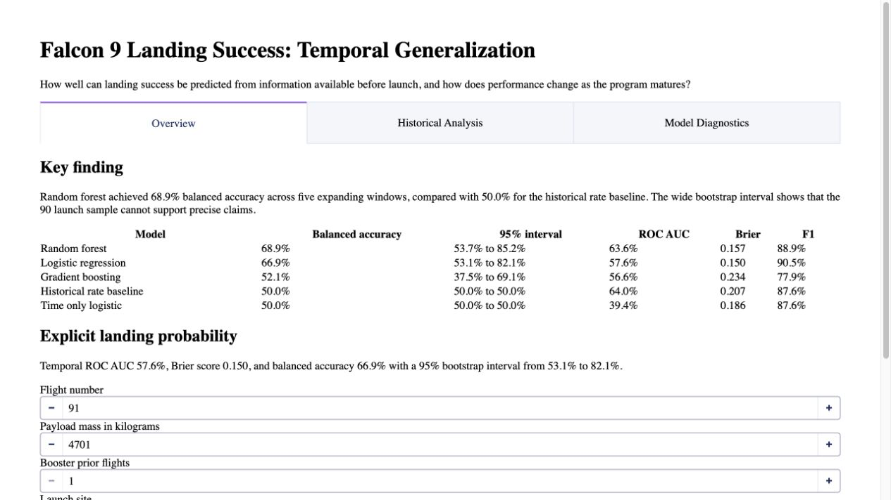
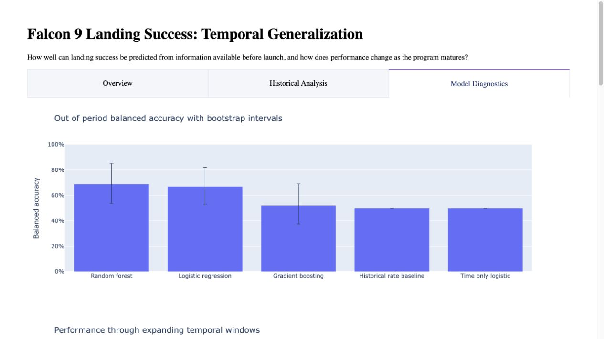

# Falcon 9 Landing Success: Temporal Generalization and Probabilistic Modeling

This project rebuilds a standard random split landing prediction exercise as a reproducible
temporal forecasting study. It asks:

> How well can Falcon 9 first stage landing success be predicted from information available before
> launch, and how does model performance change as the program matures?

The most important result is not a headline accuracy score. Performance changes materially when
models are evaluated on later launches, class balance shifts over time, and the 90 launch sample
produces wide uncertainty intervals.

## Key result

Five expanding windows evaluate every model on launches that occur after its training data.

| Model | Balanced accuracy | 95% bootstrap interval | ROC AUC | Brier | F1 |
| --- | ---: | ---: | ---: | ---: | ---: |
| Random forest | 0.689 | [0.537, 0.852] | 0.636 | 0.157 | 0.889 |
| Logistic regression | 0.669 | [0.531, 0.821] | 0.576 | 0.150 | 0.905 |
| Gradient boosting | 0.521 | [0.375, 0.691] | 0.566 | 0.234 | 0.779 |
| Historical rate baseline | 0.500 | [0.500, 0.500] | 0.640 | 0.207 | 0.876 |
| Time only logistic | 0.500 | [0.500, 0.500] | 0.394 | 0.186 | 0.876 |

Random forest leads on aggregate balanced accuracy, but its interval is too wide to support a
precise model ranking. Logistic regression is retained for interactive inference because it is
interpretable, has the best Brier score, and uses only inputs explicitly supplied by the user.

The complete generated result is in [reports/model_card.md](reports/model_card.md).



## Evaluation design

```text
Train flights 1 to 40   Test flights 41 to 50
Train flights 1 to 50   Test flights 51 to 60
Train flights 1 to 60   Test flights 61 to 70
Train flights 1 to 70   Test flights 71 to 80
Train flights 1 to 80   Test flights 81 to 90
```

Preprocessing is fitted separately inside each training window. Aggregate metrics use all 50 out
of period predictions. Fold variation and a percentile bootstrap interval show how unstable the
result is at this sample size.

The final test window contains ten successes and no failures. ROC AUC and balanced accuracy are
therefore not identifiable for that fold alone, which is why the project reports both individual
windows and aggregate out of period performance.

## Experiments

The study deliberately limits model comparison to a few contrasting approaches:

1. Historical rate baseline
2. Time only logistic regression
3. Logistic regression with explicit mission and booster inputs
4. Random forest
5. Gradient boosting

The feature ablation study compares time only, mission only, mission plus booster, all explicit
inference inputs, and all historical features. Time alone reaches only 0.500 balanced accuracy.
Mission and booster information improves that result, while the complete historical feature set
reaches 0.676. This suggests that program maturation matters, but flight number alone does not
explain the useful signal.

## Probability calibration and uncertainty

Every model is scored with accuracy, balanced accuracy, ROC AUC, Brier score, log loss, precision,
recall, and F1. The raw logistic model is compared with sigmoid calibration fitted through temporal
splits inside each training window.

Sigmoid calibration changed Brier score from 0.150 to 0.178, so it did not improve squared
probability error. The raw logistic probability remains in the application, accompanied by its
backtest metrics and uncertainty interval.

## Error analysis and interpretation

Generated diagnostics include:

1. Every incorrect out of period logistic prediction with mission context
2. Performance by expanding window
3. Calibration curves
4. Feature ablations
5. Logistic coefficient direction and magnitude
6. Permutation importance on flights 71 through 80

Flights 71 through 80 are used for permutation importance because they contain both outcomes. The
final window cannot measure class discrimination. Coefficients and importance are descriptive,
not causal, because historical era, site, and booster configuration are confounded.

## Interactive dashboard

The Dash application has three views:

1. **Overview** presents the key finding, comparison table, and explicit inference form.
2. **Historical Analysis** shows program maturation, site outcomes, payload, orbit, and reuse.
3. **Model Diagnostics** shows temporal windows, uncertainty, calibration, ablations, permutation
   importance, and prediction errors.

Every inference feature is visible: flight number, payload mass, booster prior flights, orbit,
launch site, grid fins, reuse status, and landing legs. No values are silently copied from the most
recent historical launch.



## Data and SQL architecture

```text
Verified IBM course dataset
        ↓
Schema validation and SHA 256 check
        ↓
DuckDB analytical queries
        ↓
Expanding window experiments
        ↓
Generated reports and Dash application
```

DuckDB supplies the annual, site, and modeling views. The source download is checked against a
pinned SHA 256 digest before it is cached locally.

## Run locally

Python 3.10 or newer is required.

```bash
python3 -m venv .venv
source .venv/bin/activate
python -m pip install -e ".[test]"
pytest
spacex-dashboard
```

Open `http://127.0.0.1:8051`.

To regenerate every tracked result and interactive report figure:

```bash
python scripts/generate_report.py
```

For a production WSGI server:

```bash
python -m pip install -e ".[deploy]"
gunicorn app:server
```

## Authored case study notebooks

1. `notebooks/01_exploratory_analysis.ipynb`
2. `notebooks/02_temporal_modeling.ipynb`
3. `notebooks/03_model_interpretation.ipynb`

These notebooks contain no assignment instructions, course banners, or hidden execution state.
They use the tested package as the single implementation source.

## Repository map

```text
app.py                          WSGI entry point
src/spacex_falcon/data.py       Retrieval, checksum, and validation
src/spacex_falcon/analytics.py  DuckDB analytical queries
src/spacex_falcon/features.py   Explicit feature specifications
src/spacex_falcon/evaluation.py Backtesting, models, calibration, and uncertainty
src/spacex_falcon/model.py      Deployment model and inference record
src/spacex_falcon/dashboard.py  Three view analytical application
notebooks/                      Authored portfolio case study
reports/                        Generated model card, tables, errors, and figures
tests/                          Automated scientific and application tests
archive/ibm_coursework/         Original course artifacts retained for provenance
```

## Provenance and limitations

The processed launch data and archived exercises come from the IBM Skills Network Data Science
Capstone course. The new package, temporal experiments, authored notebooks, tests, reports, and
dashboard form the portfolio case study. See [docs/PROVENANCE.md](docs/PROVENANCE.md).

This is an educational retrospective analysis, not an operational SpaceX system. The repository
does not yet declare a software license because the owner must separately confirm the terms that
apply to the archived course material.
